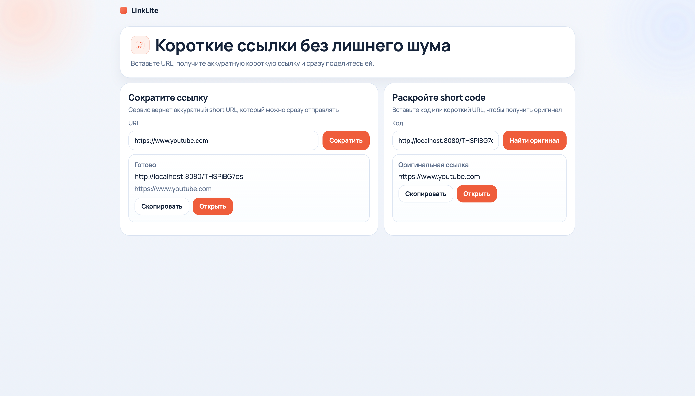
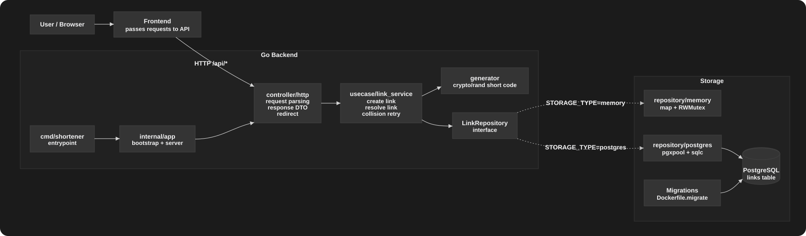

# LinkLite URL Shortener

**LinkLite** — компактный сервис для сокращения ссылок на Go. Проект реализует HTTP API, две реализации хранилища, миграции PostgreSQL, Docker Compose запуск и небольшой React/Vite frontend как бонус к заданию.

<p align="center">
  
</p>


---

## Что умеет сервис

- Создаёт короткую ссылку длиной **10 символов**.
- Использует алфавит: `a-z`, `A-Z`, `0-9`, `_`.
- Гарантирует: **один original URL → одна short link**.
- Поддерживает два хранилища:
  - `postgres` — PostgreSQL;
  - `memory` — in-memory storage внутри приложения.
- Умеет работать через HTTP API:
  - `POST /api/v1/links` — создать короткую ссылку;
  - `GET /api/v1/links/{code}` — получить original URL;
  - `GET /{code}` — redirect на original URL.
- Покрыт unit-тестами и интеграционными тестами для PostgreSQL repository.

---

## Запуск проекта

Проект можно запустить в двух режимах хранения данных. Режим выбирается командой запуска.

`.env` создавать вручную не обязательно: для быстрого старта используются значения из `.env.example`.

Если нужно переопределить порты, DSN или другие настройки, можно создать локальный `.env` рядом с `.env.example`, тогда будет использоваться значения из `.env`.

### In-memory storage

```bash
task run:memory
```

Команда поднимает backend и frontend в Docker.

В этом режиме PostgreSQL не запускается, миграции не применяются, а все ссылки хранятся в памяти процесса. После остановки контейнера созданные ссылки пропадают.

### PostgreSQL storage

```bash
task run:postgres
```

Команда поднимает PostgreSQL, применяет миграции через goose, запускает backend и frontend в Docker.

В этом режиме ссылки сохраняются в PostgreSQL и не пропадают после перезапуска backend.

### После запуска:

- Frontend: http://localhost:5173
- Backend: http://localhost:8080

### Остановка

Остановить контейнеры:

```bash
task down
```

Остановить контейнеры и удалить volume PostgreSQL:

```bash
task down:volumes
```

### Логи

Посмотреть логи всех сервисов:

```bash
task logs
```

## API

### Создать короткую ссылку

```bash
curl -X POST http://localhost:8080/api/v1/links \
  -H 'Content-Type: application/json' \
  -d '{"url":"https://example.com"}'
```

Ответ:

```json
{
  "short_url": "http://localhost:8080/PebcILe1C3"
}
```

Если повторно отправить тот же original URL, сервис вернёт уже существующую короткую ссылку, а не создаст новую.

### Получить original URL по short code

```bash
curl http://localhost:8080/api/v1/links/PebcILe1C3
```

Ответ:

```json
{
  "original_url": "https://example.com"
}
```

### Redirect

```bash
curl -i http://localhost:8080/PebcILe1C3
```

Ответ будет содержать `302 Found` и заголовок `Location` с original URL.

---

## Как генерируются короткие ссылки

Короткий код генерируется случайно через `crypto/rand`. Для каждой позиции выбирается случайный символ из алфавита:

```text
a-z A-Z 0-9 _
```

Длина кода — **10 символов**. Размер пространства вариантов:

```text
63^10 ≈ 9.84e17
```

Это очень большое количество возможных кодов, поэтому вероятность случайной коллизии мала. При этом сервис всё равно не полагается только на вероятность:

- в базе есть уникальность по `short_code`;
- в memory repository есть проверка на уже существующий `short_code`;
- если код столкнулся с существующим, `usecase` генерирует новый код и повторяет попытку;
- число попыток ограничено, чтобы не уйти в бесконечный цикл.

То есть алгоритм простой для понимания, но защищён от коллизий на уровне бизнес-логики и хранилища.

---

## Поведение при конкурентной нагрузке

Сервис рассчитан на одновременные запросы:

- PostgreSQL защищает уникальность `original_url` и `short_code` через constraints.
- Memory storage защищён `sync.RWMutex`.
- Usecase обрабатывает коллизии short code и конфликт повторного original URL.
- HTTP server настроен с timeout-ами, чтобы долгие или зависшие соединения не держали ресурсы бесконечно.

Если сотни пользователей одновременно отправят один и тот же URL, будет создана только одна запись, а остальные запросы получат уже существующую короткую ссылку.

---

## Что будет при долгой работе

В PostgreSQL-режиме данные сохраняются после перезапуска контейнера.

В memory-режиме данные живут только в памяти процесса.

При очень долгой работе основная точка роста — количество ссылок в хранилище. Для production-развития можно добавить TTL, очистку старых ссылок, rate limiting.

---

## Архитектура проекта

Проект разделён на небольшие пакеты по ответственности:

```text
cmd/shortener/                 entrypoint backend
internal/app/                  сборка приложения и lifecycle
internal/config/               загрузка и валидация env-конфига
internal/controller/http/      HTTP handlers, DTO, error mapping
internal/entity/               Link и константы предметной области
internal/errors/               общие ошибки приложения
internal/repository/memory/    in-memory storage
internal/repository/postgres/  PostgreSQL storage + sqlc
internal/usecase/              бизнес-логика и генератор кодов
migrations/                    SQL migrations для goose
```

---

## Frontend

Frontend находится в папке `frontend/`. Он нужен как бонус к заданию: можно ввести original URL, получить short URL, скопировать его или открыть в новой вкладке.

> Пакет `frontend` был сделан с помощью **ChatGPT 5.5** и не является основной частью backend-задания.

Открыть:

```text
http://localhost:5173
```

---

## Docker

В проекте используется несколько контейнеров:

- `postgres` — база данных;
- `migrate` — одноразовый контейнер с goose migrations;
- `backend` — Go-сервис;
- `frontend` — React/Vite frontend через nginx.

---

## Тесты и проверки

Unit-тесты:

```bash
task test
```

Race detector:

```bash
task test:race
```

Интеграционные тесты PostgreSQL repository:

```bash
task test:integration
```

---

## UML диаграмма

<p align="center">
  
</p>


---

## Куда можно развивать

- OpenAPI документация.
- Rate limiting.
- TTL для ссылок.
